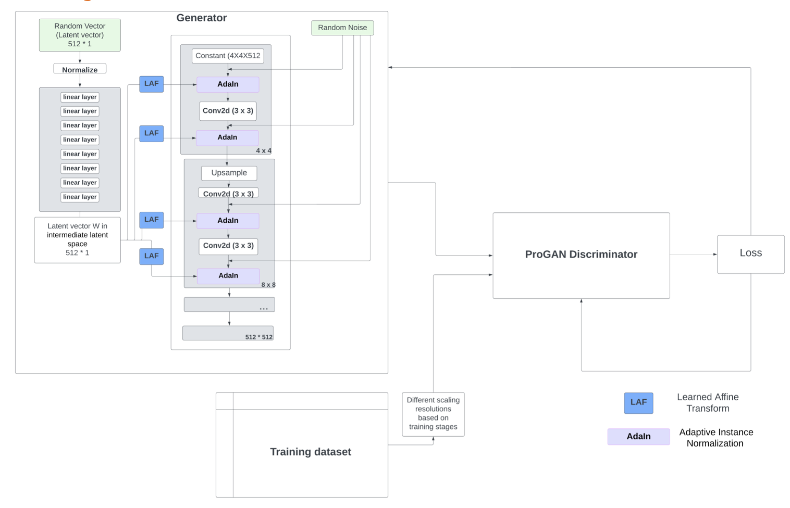
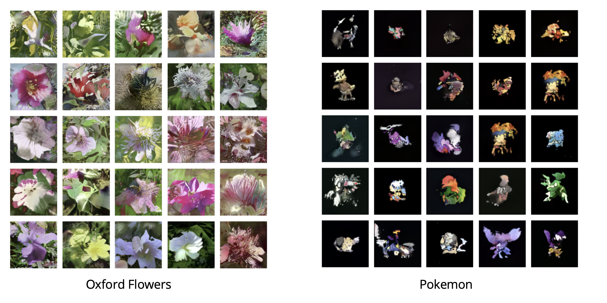

# GANalytics

📊🔬🤖🚀

Welcome to the GANalytics repository! This repository contains the codebase for StyleGAN Model with pytorch implementation. This codebase is part of a larger project that conducts a detailed analysis of the performance comparison between various generative models. Please see the presentation video here.


## File Structure

GANalytics/  
│  
│── dataset/  
│ └── Flowers  (to be downloaded)  
│ └── Pokemon  (to be downloaded)  
│  
│── README.md  
│── requirements.txt  
│── dataset_utils.py  
│── config.py  
│── model.py  
│── train_stylegan_model.py  
│── calculate_scores.py  
│── visualize_results.ipynb 

## Description

This project focuses on the implementation of StyleGan implemented in pytorch. We provide implementations for various components, including dataset preparation, model training, and inference.

## Installation

To run the code in this repository, you'll need to install the dependencies specified in requirements.txt:

You can install the required packages using pip:

```pip install -r requirements.txt```

## Setup
To use the code in this repository, follow these steps:


#### Dataset Preparation
Include the all the training images under a subdirectory in the `dataset` directory.
Modify `config.py` to add or edit dataset configurations, such as dataset location, and dataset name.

#### Training Setup
Adjust the hyperparameters as needed at the top of `train_stylegan_model.py` as needed.
To train the model, run the following command. 

```python train_stylegan_model.py {dataset name}```. 

I have trained this model on [the oxford flowers dataset](https://www.tensorflow.org/datasets/catalog/oxford_flowers102) and a subset of the Pokemon dataset.

#### Model Checkpoints
When the model is trained, parameters checkpoint will be saved to `./checkpoint/trained.pth` every 1000 iterations.

#### Evaluation Metric
Fréchet Inception Distance is used to estimate the performance. Please see `calculate_scores.py` for more details.

#### Result Visualization
Please use `plot_results.ipynb` for visualizing training results


## Model Architecture
A figure of the StyleGAN model architecture is shown below.


## Generated Samples
Sample images generated from training the StyleGAN model on the Oxford Flowers dataset are shown in the following figure.




## Next steps
Implementing style-mixing feature is considered as a next step.

## Live Presentation
https://www.youtube.com/watch?v=yZ9bIT23XEw

## Contributing
Contributions to this project are welcome! If you'd like to contribute, please follow these guidelines:

Fork the repository.
Create a new branch for your feature or bug fix.
Make your changes and commit them with descriptive messages.
Push your changes to your fork.
Submit a pull request to the main repository.
Feel free to reach out at shaoyuli@alumni.cmu.edu for any questions, discussions, or collaboration opportunities!

